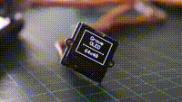

# seeed-grove

Go support for the Seeed Grove ecosystem on XIAO boards, compiled with
[TinyGo](https://tinygo.org).

## 📦 Got the TinyGo Starter Kit? [**Start here →**](docs/README.md)

The [guide](docs/README.md) walks you from zero — no electronics experience —
through every module in the kit, one concept at a time, ending with full
multi-device projects.

## What's in this repository

- **[`grove`](grove.go)** (root package) — the Grove shield abstraction
  (`ShieldXiao`, `Conn`) and simple analog sensor types (light, rotary angle,
  sound, temperature, RGB strip). Works on the whole XIAO family:
  ESP32-C3/S3/C6, RP2040, RP2350, nRF52840 (ble).
- **[`drivers/`](drivers/)** — device drivers: [`lis3dh`](drivers/lis3dh/)
  3-axis accelerometer, [`ssd1306`](drivers/ssd1306/) OLED display with
  drawing and font support.
- **[`examples/`](examples/)** — runnable programs:
  [one per Grove module](examples/examples-grove-single/) plus
  [integration](examples/grove-clown-house/) and
  [audio streaming](examples/grove-sound-wav/) projects.
- **[`docs/`](docs/)** — the starter kit guide. Code blocks in the guide are
  spliced from `examples/` by [`internal/docgen`](internal/docgen/main.go);
  refresh with `go generate ./...`.

## Kit modules

| Module | Buy | Example | Wiki | Guide |
|--------|-----|---------|------|-------|
| Buzzer | [Product page](https://www.seeedstudio.com/Grove-Buzzer.html) | [Example code](./examples/examples-grove-single/grove-buzzer/grove-buzzer.go) | [Wiki page](https://wiki.seeedstudio.com/Grove-Buzzer/) | [Docs here](./docs/devices/01-buzzer.md) |
| Touch Sensor | [Product page](https://www.seeedstudio.com/Grove-Touch-Sensor.html) | [Example code](./examples/examples-grove-single/grove-touch/grove-touch.go) | [Wiki page](https://wiki.seeedstudio.com/Grove-Touch_Sensor/) | [Docs here](./docs/devices/02-touch.md) |
| Light Sensor v1.2 | [Product page](https://www.seeedstudio.com/Grove-Light-Sensor-v1.2-p-2727.html) | [Example code](./examples/examples-grove-single/grove-light-sensor/grove-light-sensor.go) | [Wiki page](https://wiki.seeedstudio.com/Grove-Light_Sensor/) | [Docs here](./docs/devices/03-light-sensor.md) |
| Rotary Angle Sensor | [Product page](https://www.seeedstudio.com/Grove-Rotary-Angle-Sensor.html) | [Example code](./examples/examples-grove-single/grove-rotary/grove-rotary.go) | [Wiki page](https://wiki.seeedstudio.com/Grove-Rotary_Angle_Sensor/) | [Docs here](./docs/devices/04-rotary.md) |
| Sound Sensor | [Product page](https://www.seeedstudio.com/Grove-Sound-Sensor-p-752.html) | [Example code](./examples/examples-grove-single/grove-sound/grove-sound.go) | [Wiki page](https://wiki.seeedstudio.com/Grove-Sound_Sensor/) | [Docs here](./docs/devices/05-sound.md) |
| Temperature Sensor | [Product page](https://www.seeedstudio.com/Grove-Temperature-Sensor-p-774.html) | [Example code](./examples/examples-grove-single/grove-temperature/grove-temperature.go) | [Wiki page](https://wiki.seeedstudio.com/Grove-Temperature_Sensor_V1.2/) | [Docs here](./docs/devices/06-temperature.md) |
| Piezo Vibration Sensor | [Product page](https://www.seeedstudio.com/Grove-Piezo-Vibration-Sensor.html) | [Example code](./examples/examples-grove-single/grove-piezo/grove-piezo.go) | [Wiki page](https://wiki.seeedstudio.com/Grove-Piezo_Vibration_Sensor/) | [Docs here](./docs/devices/07-piezo.md) |
| RGB LED Stick (10 × WS2813 Mini) | [Product page](https://www.seeedstudio.com/Grove-RGB-LED-Stick-10-WS2813-Min-p-3226.html) | [Example code](./examples/examples-grove-single/grove-rgbled/rgbled.go) | [Wiki page](https://wiki.seeedstudio.com/Grove-RGB_LED_Stick-10-WS2813_Mini/) | [Docs here](./docs/devices/08-rgb-led.md) |
| OLED Display 0.96″ (SSD1315) | [Product page](https://www.seeedstudio.com/Grove-OLED-Display-0-96-SSD1315-p-4294.html) | [Example code](./examples/examples-grove-single/grove-oled-display/oled-display.go) | [Wiki page](https://wiki.seeedstudio.com/Grove-OLED-Display-0.96-SSD1315/) | [Docs here](./docs/devices/09-oled-display.md) |
| 3-Axis Digital Accelerometer (LIS3DHTR) | [Product page](https://www.seeedstudio.com/Grove-3-Axis-Digital-Accelerometer-LIS3DHTR-p-4533.html) | [Example code](./examples/examples-grove-single/grove-accelerometer-3axis/grove-accelerometer.go) | [Wiki page](https://wiki.seeedstudio.com/Grove-3-Axis-Digital-Accelerometer-LIS3DHTR/) | [Docs here](./docs/devices/10-accelerometer.md) |

## Quick start

```sh
tinygo flash -target=xiao-esp32c3 ./examples/hello-world/
tinygo monitor
```

Using a different XIAO board? Swap the target: `xiao-esp32s3`, `xiao-rp2040`,
`xiao-rp2350`, `xiao-ble`.

## Audiovisual examples

### grove-oled-display example


### grove-sound-wav example (microphone and .WAV recorder on PC)
***Turn sound on in video!***
<video src="https://github.com/user-attachments/assets/21e4de98-c6fb-4e04-8663-23bb04abb684" controls></video>

